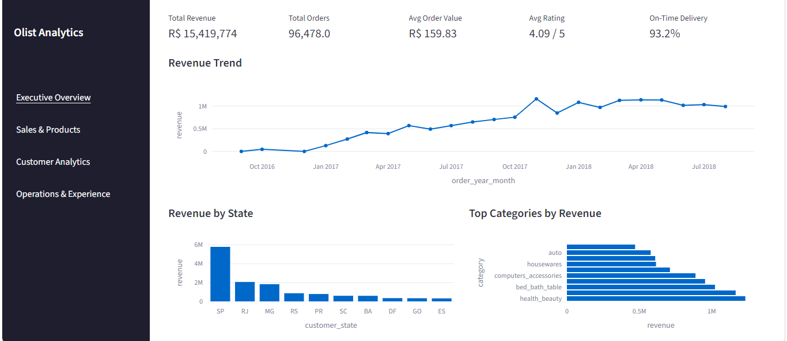
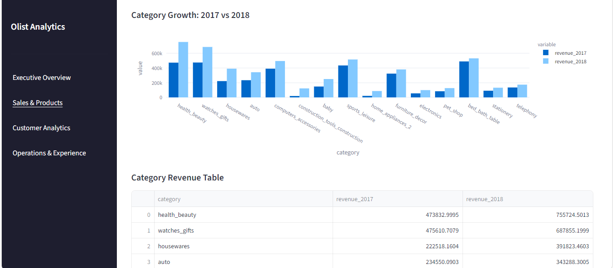
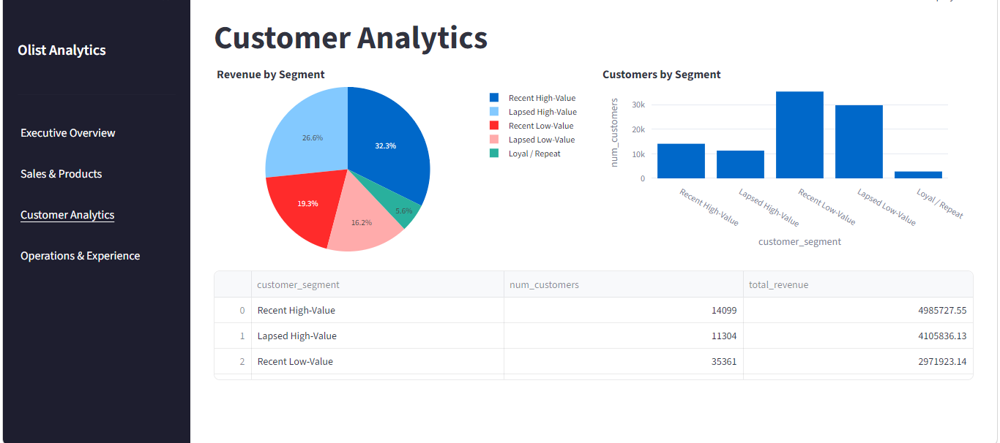
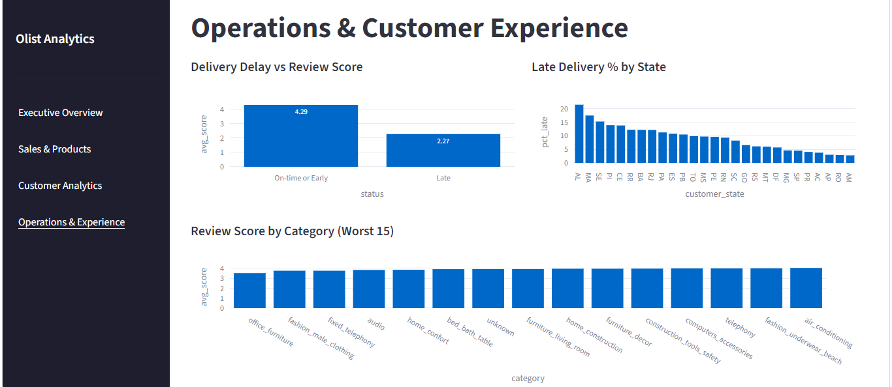

# Olist E-Commerce Sales, Customer & Operations Analytics

End-to-end analysis of ~99,000 orders from Olist, a Brazilian e-commerce marketplace (Sept 2016 – Aug 2018). This project goes from raw data acquisition through cleaning, a relational MySQL data model, business-focused SQL analysis, statistical validation in Python, and an interactive Streamlit dashboard — answering concrete business questions about revenue, customer value, delivery performance, and what drives customer satisfaction.

**[Read the full findings and recommendations](reports/Business_insights.md)**

---

## Headline Finding

Orders delivered late average a **2.27/5** review score vs. **4.29/5** for on-time orders (Welch's t-test: t = -100.76, p < 0.001, n = 95,607). Delivery reliability is the strongest driver of customer satisfaction in this dataset — stronger than product category, price, or region alone. Two distinct, separable root causes were identified: a specific São Paulo → Rio de Janeiro shipping corridor problem, and a tail of chronically underperforming individual sellers cutting across regions.

Full writeup with supporting evidence, customer segmentation, and ranked recommendations: [`reports/business_insights.md`](reports/Business_insights.md)

---

## Dashboard

Built with Streamlit + Plotly, connected live to a MySQL database. Four pages: Executive Overview, Sales & Products, Customer Analytics, Operations & Experience.

```bash
streamlit run dashboard/app.py
```

---

## Dashboard Preview

### Executive Overview


### Sales & Products


### Customer Analytics


### Operations & Experience


## Tech Stack

- **Python** (pandas, numpy, scipy) — data cleaning, EDA, statistical testing
- **MySQL** — relational data model, business analytics queries
- **SQLAlchemy** — Python ↔ MySQL connection
- **Streamlit + Plotly** — interactive dashboard
- **Jupyter** — analysis notebooks

---

## Project Structure

```
├── data/
│   └── processed/          # cleaned datasets (generated by 02_data_cleaning.ipynb)
├── notebooks/
│   ├── 01_data_profiling.ipynb
│   ├── 02_data_cleaning.ipynb
│   ├── 03_load_to_sql.ipynb
│   └── 04_eda.ipynb
├── sql/
│   ├── 01_schema.sql              # table definitions
│   ├── 02_load_data.sql           # canonical data load (LOAD DATA INFILE)
│   ├── 02_data_fixes.sql          # boolean/data-type post-load corrections
│   ├── 03_sales_analysis.sql      # revenue, category, geography queries
│   ├── 04_customer_analysis.sql   # RFM segmentation, cohort retention
│   ├── 05_operations_analysis.sql # delivery performance by state/category/seller
│   └── 06_customer_experience.sql # review score analysis
├── dashboard/
│   └── app.py
├── reports/
│   ├── business_insights.md       # full findings & recommendations
│   ├── monthly_revenue_trend.png
│   └── delay_vs_review.png
├── requirements.txt
└── README.md
```

---

## How to Reproduce

1. **Get the data** — [Olist Brazilian E-Commerce dataset](https://www.kaggle.com/datasets/olistbr/brazilian-ecommerce) on Kaggle. Download and place the 9 CSVs in `data/raw/`.

2. **Install dependencies**
   ```bash
   pip install -r requirements.txt
   ```

3. **Set up environment variables** — copy `.env.example` to `.env` and fill in your MySQL credentials.

4. **Run the notebooks in order**
   - `01_data_profiling.ipynb` — inspect the raw data
   - `02_data_cleaning.ipynb` — clean and derive metrics, outputs to `data/processed/`
   - Create the MySQL schema: `mysql -u root -p your_db_name < sql/01_schema.sql`
   - Load data: `mysql -u root -p --local-infile=1 your_db_name`, then `source sql/02_load_data.sql;`
   - `03_load_to_sql.ipynb` — verify the load
   - `04_eda.ipynb` — statistical analysis and charts

5. **Run the business SQL queries** in `sql/03` through `sql/06` for the underlying analysis.

6. **Launch the dashboard**
   ```bash
   streamlit run dashboard/app.py
   ```

---

## Key Business Questions Answered

- **Sales**: How has revenue trended over time? Which categories and states drive the most revenue?
- **Customers**: What does the customer base look like by value and recency? How much revenue comes from high-value vs. low-value segments? Do customers return?
- **Operations**: Where are delivery delays concentrated — geographically, by category, by seller?
- **Experience**: Does delivery performance affect review scores, and can we prove it statistically?

See [`reports/business_insights.md`](reports/Business_insights.md) for the full answers, methodology notes, and an honest accounting of what this dataset *cannot* answer.
